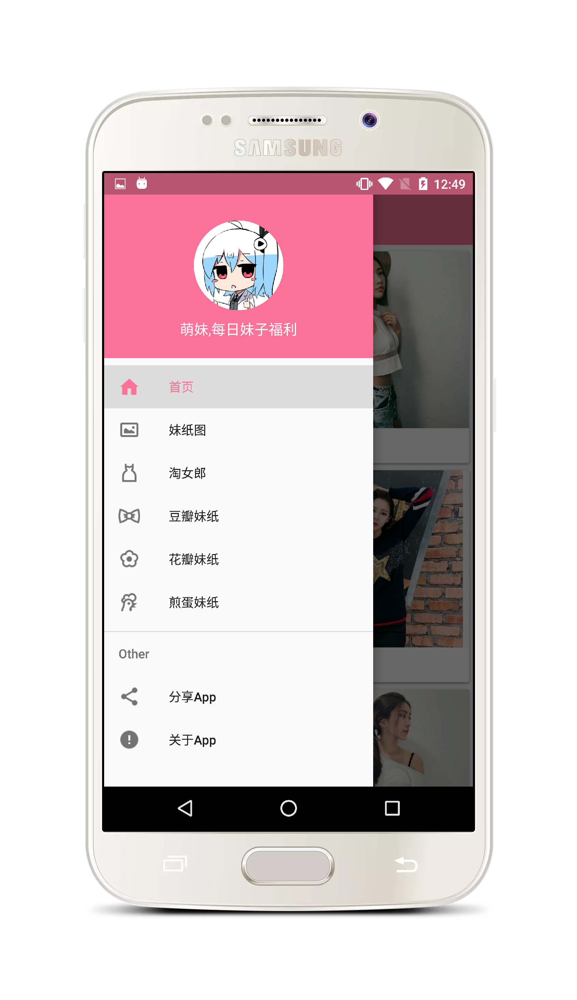
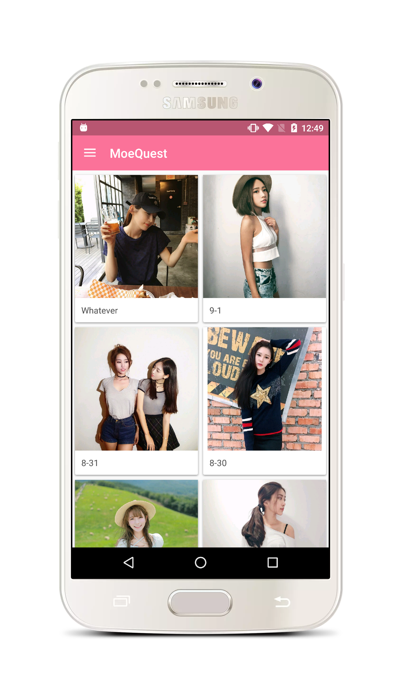
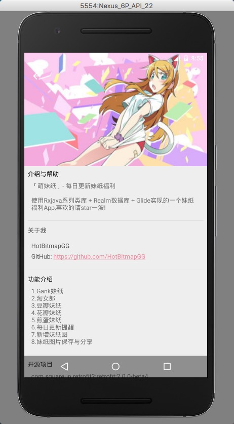
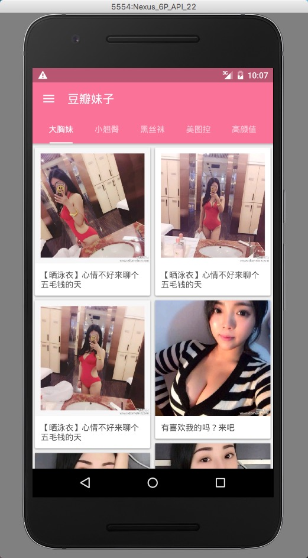
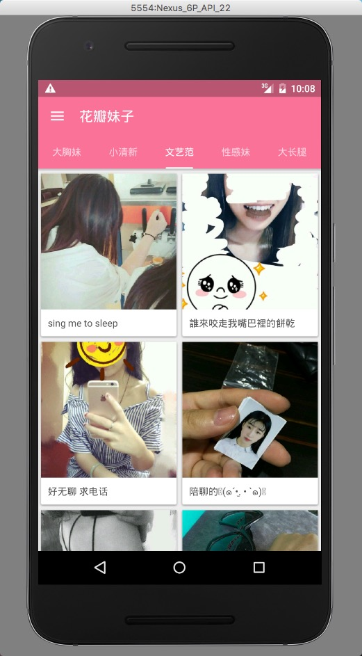
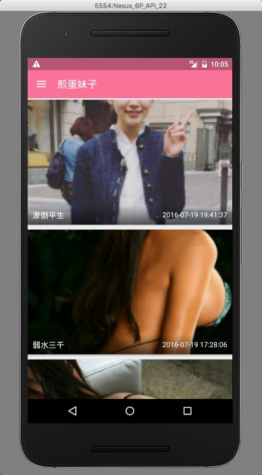
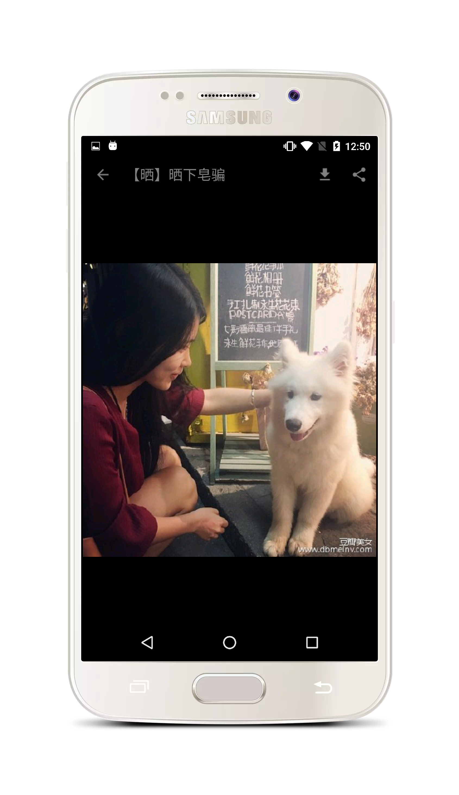
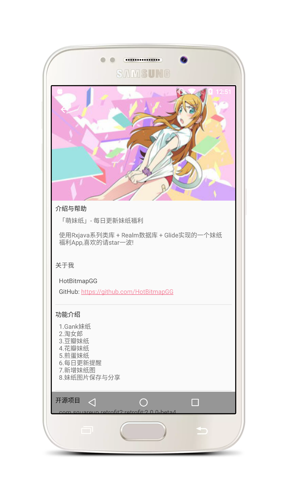

# 萌妹纸

   

The meizi of a material design style welfare App & 一款MaterialDesign风格的妹子福利App.

# 简介

* 每日更新各种妹纸福利,喜欢的请star一波,谢谢啦.

## 功能介绍

* 1.数据均来自抓取各大网站妹子福利图,gank,豆瓣,花瓣,煎蛋,淘女郎,妹子图.
* 2.使用Rxjava系列类库 + Realm数据库 + Glide实现.
* 3.遵循Google的Material Design.

## 更新说明

### V2.1.1
  * 1.修复了一个issuse提出的崩溃问题,界面共享元素动画使用的问题.

### v2.1
  * 1.修复了部分bug.
  * 2.新增妹纸图模块.

### v2.0
  * 1.关闭了两个issuse,修改了一个RecycleView刷新的bug,解决方案来自@drakeet大神.
  * 2.增加了gank和豆瓣妹纸的界面共享元素动画效果.
  * 3.优化了部分代码,会持续优化中.

## Apk下载

* 更新到v2.1.1

## 截图

 

 

 

 

 

## 声明

本项目所使用API主要来Gank.io,易源接口,以及抓取各网站数据,若被告知需停止共享与使用，本人会及时删除此页面与整个项目,请您暸解相关情况，并遵守开源协议.

## About me

An android developer in Wuhan.

If you want to make friends with me, You can focus on my weibo.

## License

 Copyright 2016 HotBitmapGG

 Licensed under the Apache License, Version 2.0 (the "License"); you may not use this file except in compliance with the License. You may obtain a copy of the License at

 http://www.apache.org/licenses/LICENSE-2.0

 Unless required by applicable law or agreed to in writing, software distributed under the License is distributed on an "AS IS" BASIS, WITHOUT WARRANTIES OR CONDITIONS OF ANY KIND, either express or implied. See the License for the specific language governing permissions and limitations under the License.

